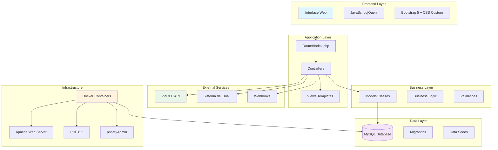
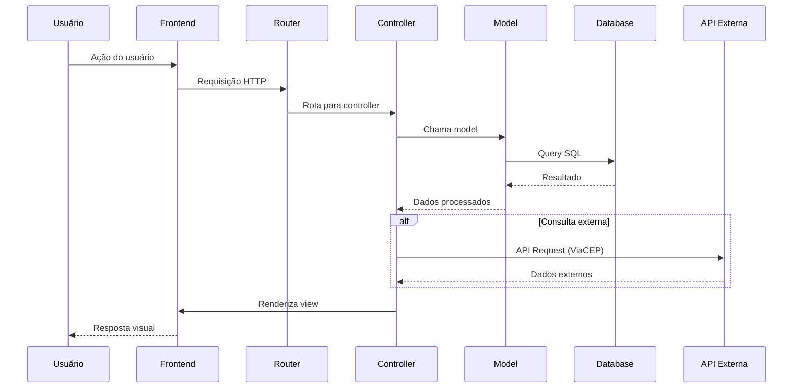
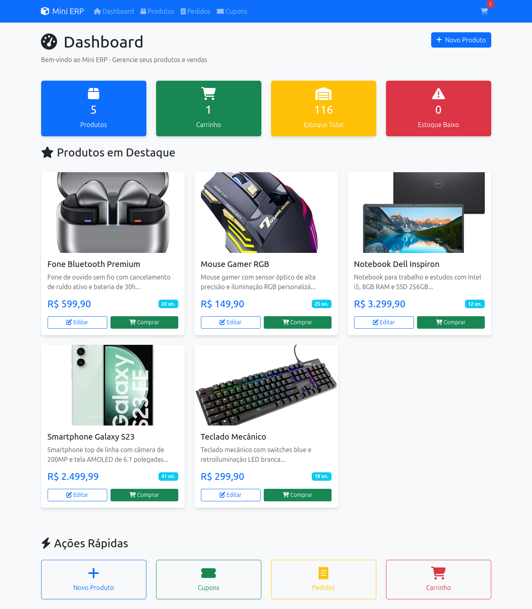
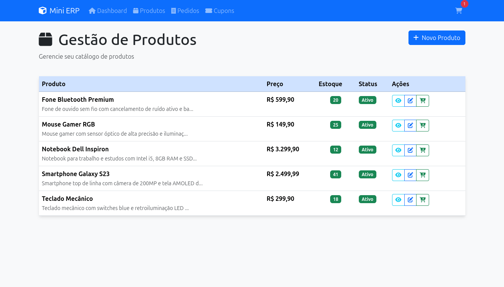
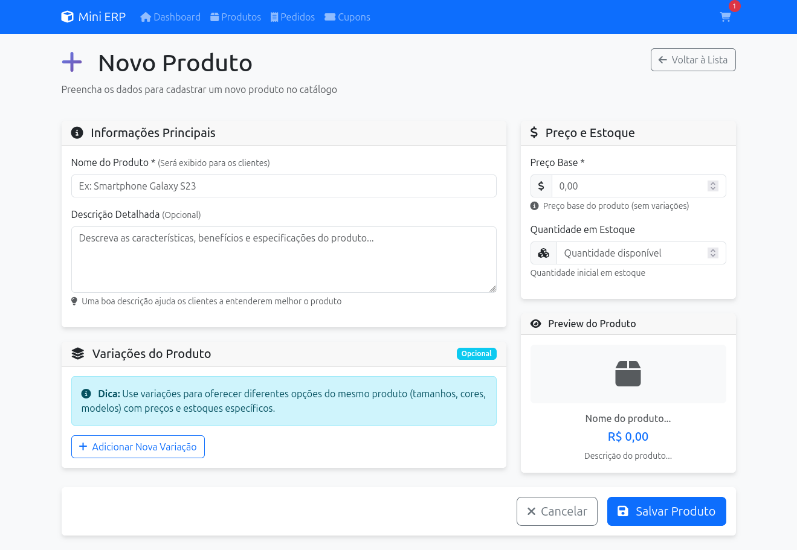
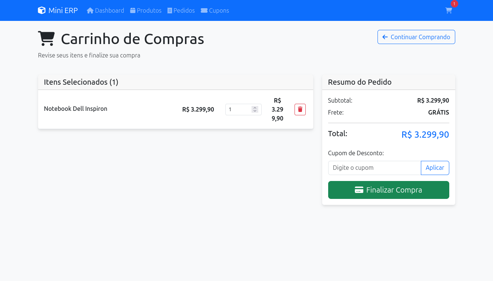
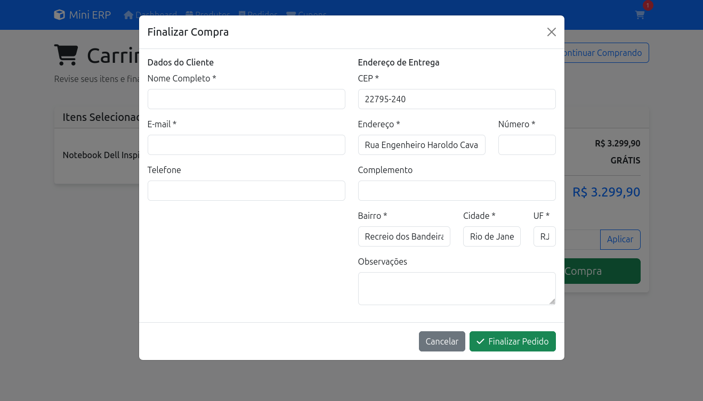
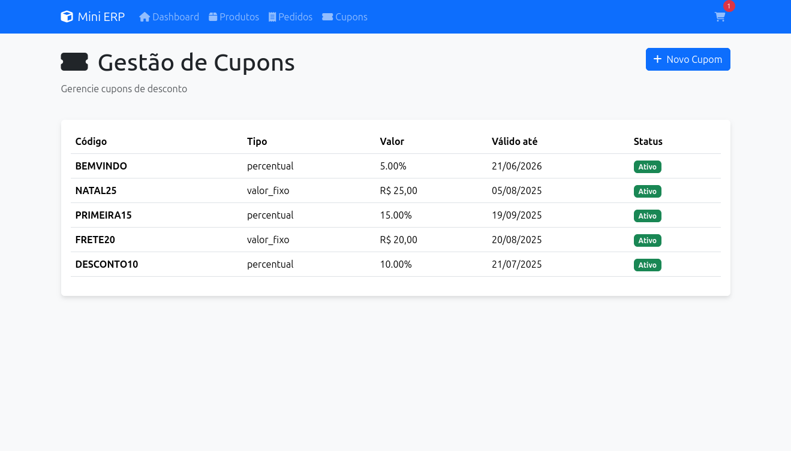
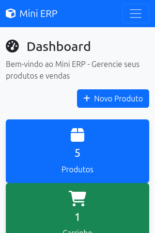

# 🚀 Mini ERP - Sistema de Gestão Completo

[](https://php.net)
[](https://mysql.com)
[](https://getbootstrap.com)
[](https://docker.com)

> **Sistema completo de gestão para controle de Produtos, Pedidos, Cupons e Estoque desenvolvido para o teste técnico da Montink.**

---

## 📋 Índice

- [📖 Sobre o Projeto](#-sobre-o-projeto)
- [🏗️ Arquitetura](#️-arquitetura)
- [✨ Funcionalidades](#-funcionalidades)
- [🛠️ Tecnologias](#️-tecnologias)
- [⚡ Instalação Rápida](#-instalação-rápida)
- [🔧 Instalação Detalhada](#-instalação-detalhada)
- [📂 Estrutura do Projeto](#-estrutura-do-projeto)
- [🌐 APIs e Endpoints](#-apis-e-endpoints)
- [📸 Screenshots](#-screenshots)
- [🧪 Testes](#-testes)
- [🚀 Deploy](#-deploy)
- [📝 Licença](#-licença)

---

## 📖 Sobre o Projeto

O **Mini ERP** é um sistema completo de gestão empresarial desenvolvido com **PHP puro**, seguindo as melhores práticas de desenvolvimento e arquitetura **MVC**. O sistema oferece funcionalidades essenciais para controle de estoque, gestão de produtos, processamento de pedidos e sistema de cupons de desconto.

### 🎯 Objetivo

Criar uma solução robusta e escalável para pequenas e médias empresas gerenciarem seus produtos e vendas de forma eficiente, com interface moderna e intuitiva.

---

## 🏗️ Arquitetura



### 🔄 Fluxo de Dados



---

## ✨ Funcionalidades

### 🏪 **Gestão de Produtos**
- ✅ **CRUD Completo**: Criar, visualizar, editar e gerenciar produtos
- ✅ **Variações de Produto**: Suporte a variações (tamanhos, cores, etc.) com preços específicos
- ✅ **Controle de Estoque**: Gestão automática de estoque por produto/variação
- ✅ **Alertas de Estoque**: Notificações para produtos com estoque baixo
- ✅ **Busca e Filtros**: Sistema avançado de busca e filtros
- ✅ **Status de Produtos**: Ativar/desativar produtos na loja

### 🛒 **Sistema de Carrinho**
- ✅ **Carrinho em Sessão**: Persistência durante a navegação
- ✅ **Adição via AJAX**: Interface responsiva sem recarregamento
- ✅ **Controle de Quantidade**: Atualização dinâmica de quantidades
- ✅ **Validação de Estoque**: Verificação automática de disponibilidade
- ✅ **Cálculo Automático**: Subtotal, frete e total em tempo real

### 📦 **Processamento de Pedidos**
- ✅ **Finalização Completa**: Processo de checkout intuitivo
- ✅ **Gestão de Status**: Acompanhamento do status do pedido
- ✅ **Dados do Cliente**: Coleta completa de informações
- ✅ **Endereço de Entrega**: Integração com ViaCEP para preenchimento automático
- ✅ **Numeração Sequencial**: Sistema de numeração único por pedido
- ✅ **Email de Confirmação**: Notificação automática por email

### 🎟️ **Sistema de Cupons**
- ✅ **Tipos de Desconto**: Percentual ou valor fixo
- ✅ **Regras de Negócio**: Valor mínimo do pedido
- ✅ **Período de Validade**: Data de início e fim
- ✅ **Limite de Uso**: Controle de quantidade de usos
- ✅ **Aplicação Automática**: Interface amigável no carrinho

### 📊 **Controle de Estoque**
- ✅ **Movimentação Automática**: Entrada e saída automática
- ✅ **Histórico Completo**: Log de todas as movimentações
- ✅ **Estoque por Variação**: Controle independente por variação
- ✅ **Alertas Inteligentes**: Notificações de estoque baixo
- ✅ **Relatórios**: Visualização de movimentações

### 🚚 **Cálculo de Frete**
- ✅ **Regras Automáticas**: 
  - Frete **GRÁTIS** para compras acima de R$ 200,00
  - Frete **R$ 15,00** para compras entre R$ 52,00 e R$ 166,59
  - Frete **R$ 20,00** para outras compras
- ✅ **Integração com CEP**: Consulta automática de endereço via ViaCEP

### 🔗 **APIs e Integrações**
- ✅ **ViaCEP Integration**: Preenchimento automático de endereço
- ✅ **Webhooks**: Atualização de status via webhook
- ✅ **API RESTful**: Endpoints para integrações externas
- ✅ **Sistema de Email**: Notificações automáticas

### 🎨 **Interface e UX**
- ✅ **Design Moderno**: Interface limpa e intuitiva
- ✅ **Responsivo**: Funciona perfeitamente em mobile e desktop
- ✅ **Animações**: Transições suaves e feedback visual
- ✅ **Acessibilidade**: Seguindo padrões de acessibilidade
- ✅ **Toast Notifications**: Feedback em tempo real
- ✅ **Loading States**: Estados de carregamento para melhor UX

---

## 🛠️ Tecnologias

### **Backend**
- **PHP 8.1+** - Linguagem principal
- **MySQL 8.0** - Banco de dados
- **Apache** - Servidor web
- **PDO** - Abstração de banco de dados

### **Frontend**
- **HTML5** - Estrutura
- **CSS3** - Estilização avançada
- **Bootstrap 5.3** - Framework CSS
- **JavaScript (ES6+)** - Interatividade
- **jQuery 3.7** - Manipulação DOM
- **Font Awesome** - Ícones

### **DevOps & Ferramentas**
- **Docker** - Containerização
- **Docker Compose** - Orquestração
- **phpMyAdmin** - Administração do banco
- **Git** - Controle de versão

### **APIs Externas**
- **ViaCEP** - Consulta de CEP
- **SMTP** - Envio de emails

---

## ⚡ Instalação Rápida

### Pré-requisitos
- Docker & Docker Compose instalados
- Git instalado
- Portas 8080, 8081 e 3306 livres

### 🚀 3 Passos para Rodar

```bash
# 1. Clone o repositório
git clone https://github.com/rafaelferreira2312/teste-montink-backend.git


# 2. Execute os scripts de instalação
cd teste-montink-backend

# 3. Inicie a aplicação
docker-compose up -d build

# 4. Verificar status
docker-compose ps

# 5. Ver logs
docker-compose logs -f
```

**Pronto! 🎉**
- **Aplicação**: http://localhost:8080
- **phpMyAdmin**: http://localhost:8081

---


### 4. **Comandos Úteis**

```bash

# Backup do banco
docker exec mini_erp_mysql mysqldump -u root -proot123 mini_erp > backup.sql

# Restaurar backup
docker exec -i mini_erp_mysql mysql -u root -proot123 mini_erp < backup.sql
```

---

## 📂 Estrutura do Projeto

```
mini-erp/
├── 📁 app/                          # Aplicação principal
│   ├── 📁 config/                   # Configurações
│   │   ├── 🔧 config.php           # Configuração geral
│   │   └── 🗄️ database.php         # Conexão com banco
│   ├── 📁 controllers/              # Controllers MVC
│   │   ├── 🏠 HomeController.php    # Dashboard
│   │   ├── 📦 ProdutoController.php # Gestão de produtos
│   │   ├── 🛒 CarrinhoController.php# Carrinho de compras
│   │   ├── 📋 PedidoController.php  # Processamento de pedidos
│   │   ├── 🎟️ CupomController.php   # Sistema de cupons
│   │   ├── 🔌 ApiController.php     # APIs externas
│   │   └── 🎣 WebhookController.php # Webhooks
│   ├── 📁 models/                   # Models MVC
│   │   ├── 📊 BaseModel.php         # Classe base
│   │   ├── 📦 Produto.php           # Model de produtos
│   │   ├── 📊 Estoque.php           # Controle de estoque
│   │   ├── 🎟️ Cupom.php            # Sistema de cupons
│   │   └── 📋 Pedido.php            # Gestão de pedidos
│   ├── 📁 views/                    # Templates e Views
│   │   ├── 🎨 layout.php            # Layout principal
│   │   ├── 🏠 home.php              # Dashboard
│   │   ├── 📁 produtos/             # Views de produtos
│   │   ├── 📁 carrinho/             # Views do carrinho
│   │   ├── 📁 pedidos/              # Views de pedidos
│   │   ├── 📁 cupons/               # Views de cupons
│   │   └── 🚫 404.php               # Página de erro
│   └── 📁 public/                   # Arquivos públicos
│       ├── 🎯 index.php             # Ponto de entrada
│       ├── 🔗 .htaccess             # Configuração Apache
│       ├── 📁 css/                  # Estilos customizados
│       ├── 📁 js/                   # JavaScript customizado
│       └── 📁 images/               # Imagens
├── 📁 database/                     # Banco de dados
│   ├── 📁 migrations/               # Scripts de criação
│   └── 📁 seeds/                    # Dados de exemplo
├── 📁 docker/                       # Configuração Docker
│   └── 📁 php/                      # Container PHP
├── 📁 logs/                         # Logs da aplicação
├── 📁 uploads/                      # Arquivos enviados
├── 📁 screenshots/                  # Capturas de tela
├── 🐳 docker-compose.yml           # Orquestração Docker
├── 🔧 .env                         # Variáveis de ambiente
├── 📝 .gitignore                   # Exclusões do Git
├── 🚀 start.sh                     # Script de inicialização
├── 🛑 stop.sh                      # Script para parar
├── 🔄 reset.sh                     # Script de reset
└── 📖 README.md                    # Esta documentação
```

---

## 🌐 APIs e Endpoints

### **Rotas Principais**

| Método | Endpoint | Descrição |
|--------|----------|-----------|
| `GET` | `/` | Dashboard principal |
| `GET` | `/produtos` | Lista de produtos |
| `GET` | `/produto/criar` | Formulário de produto |
| `POST` | `/produto/salvar` | Salvar novo produto |
| `GET` | `/produto/editar?id={id}` | Editar produto |
| `POST` | `/produto/atualizar` | Atualizar produto |
| `GET` | `/carrinho` | Visualizar carrinho |
| `POST` | `/carrinho/adicionar` | Adicionar item (AJAX) |
| `POST` | `/carrinho/remover` | Remover item |
| `GET` | `/pedidos` | Lista de pedidos |
| `POST` | `/pedido/finalizar` | Finalizar compra |
| `GET` | `/cupons` | Lista de cupons |

### **APIs Externas**

| Endpoint | Método | Descrição |
|----------|--------|-----------|
| `/api/cep` | `GET` | Consultar CEP via ViaCEP |
| `/api/produtos` | `GET` | Buscar produtos |
| `/api/estoque` | `GET` | Verificar estoque |
| `/api/frete` | `GET` | Calcular frete |
| `/api/status` | `GET` | Status do sistema |

### **Webhooks**

| Endpoint | Método | Descrição |
|----------|--------|-----------|
| `/webhook/pedido` | `POST` | Atualizar status do pedido |
| `/webhook/estoque` | `POST` | Notificar estoque baixo |
| `/webhook/teste` | `GET` | Testar webhook |

### **Exemplo de Uso - Webhook de Pedido**

```bash
curl -X POST http://localhost:8080/webhook/pedido \
  -H "Content-Type: application/json" \
  -H "X-Webhook-Signature: sha256=..." \
  -d '{
    "pedido_id": 123,
    "status": "enviado"
  }'
```

**Resposta:**
```json
{
  "success": true,
  "message": "Status atualizado com sucesso",
  "pedido_id": 123,
  "status": "enviado",
  "timestamp": "2025-06-21T10:30:00Z"
}
```

---

## 📸 Screenshots

> **Nota**: Adicione suas capturas de tela na pasta `/screenshots/` seguindo a nomenclatura abaixo:

### 🏠 **Dashboard Principal**

*Visão geral com estatísticas e produtos em destaque*

### 📦 **Gestão de Produtos**

*Lista completa de produtos com filtros e busca*

### 📝 **Formulário de Produto**

*Cadastro/edição de produtos com variações*

### 🛒 **Carrinho de Compras**

*Interface do carrinho com cálculo automático*

### 💳 **Checkout**

*Processo de finalização com integração ViaCEP*

### 📋 **Lista de Pedidos**

*Gestão e acompanhamento de pedidos*

### 🎟️ **Sistema de Cupons**

*Criação e gerenciamento de cupons*

### 📱 **Versão Mobile**

*Interface responsiva para dispositivos móveis*

---

## 🧪 Testes

### **Dados de Teste Inclusos**

O sistema vem com dados de exemplo pré-carregados:

#### **Produtos de Exemplo**
- Smartphone Galaxy S23 (com variações)
- Notebook Dell Inspiron
- Mouse Gamer RGB
- Teclado Mecânico
- Fone Bluetooth Premium

#### **Cupons de Teste**
- `DESCONTO10` - 10% para pedidos acima de R$ 100
- `FRETE20` - R$ 20 de desconto (frete grátis)
- `PRIMEIRA15` - 15% para pedidos acima de R$ 200
- `NATAL25` - R$ 25 de desconto
- `BEMVINDO` - 5% sem valor mínimo

#### **CEPs para Teste**
- `01310-100` - Av. Paulista, São Paulo
- `20040-020` - Centro, Rio de Janeiro
- `30112-000` - Centro, Belo Horizonte

### **Fluxo de Teste Completo**

1. **Acesse o dashboard** → http://localhost:8080
2. **Adicione produtos** ao carrinho
3. **Aplique um cupom** (ex: `DESCONTO10`)
4. **Finalize a compra** com CEP `01310-100`
5. **Verifique o email** de confirmação nos logs
6. **Teste o webhook** de atualização de status

### **Testes de API**

```bash
# Teste de consulta CEP
curl "http://localhost:8080/api/cep?cep=01310100"

# Teste de status do sistema
curl "http://localhost:8080/api/status"

# Teste de webhook
curl -X POST http://localhost:8080/webhook/teste
```

---

## 🚀 Deploy

### **Deploy em Produção**

#### **1. Preparação do Servidor**
```bash
# Instalar Docker
curl -fsSL https://get.docker.com -o get-docker.sh
sh get-docker.sh

# Instalar Docker Compose
sudo curl -L "https://github.com/docker/compose/releases/download/v2.20.0/docker-compose-$(uname -s)-$(uname -m)" -o /usr/local/bin/docker-compose
sudo chmod +x /usr/local/bin/docker-compose
```

#### **2. Configuração de Produção**
```bash
# Clonar em produção
git clone https://github.com/seu-usuario/mini-erp.git
cd mini-erp

# Configurar ambiente
cp .env.example .env
nano .env  # Editar configurações de produção
```

#### **3. Configurações de Segurança**

Edite o arquivo `.env` para produção:
```env
APP_ENV=production
APP_DEBUG=false
DB_PASSWORD=senha_super_segura_123
WEBHOOK_SECRET=webhook_secret_muito_seguro

# Configurações de email reais
MAIL_HOST=smtp.seudominio.com
MAIL_USERNAME=noreply@seudominio.com
MAIL_PASSWORD=senha_do_email
```

#### **4. SSL e Domínio**

Configure um proxy reverso com Nginx:
```nginx
server {
    listen 80;
    server_name seudominio.com;
    return 301 https://$server_name$request_uri;
}

server {
    listen 443 ssl;
    server_name seudominio.com;
    
    ssl_certificate /path/to/cert.pem;
    ssl_certificate_key /path/to/key.pem;
    
    location / {
        proxy_pass http://localhost:8080;
        proxy_set_header Host $host;
        proxy_set_header X-Real-IP $remote_addr;
    }
}
```

### **Monitoramento**

```bash
# Logs em tempo real
docker-compose logs -f

# Status dos containers
docker-compose ps

# Uso de recursos
docker stats
```

---

## 🔒 Segurança

### **Medidas Implementadas**

- ✅ **Sanitização de Entrada**: Todos os dados são sanitizados
- ✅ **Prepared Statements**: Proteção contra SQL Injection
- ✅ **CSRF Protection**: Token de proteção em formulários
- ✅ **XSS Protection**: Escape de dados na saída
- ✅ **Headers de Segurança**: Configurados no .htaccess
- ✅ **Validação de Webhook**: Assinatura HMAC SHA256
- ✅ **Controle de Acesso**: Verificação de permissões

### **Configurações Recomendadas**

```apache
# .htaccess adicional para produção
Header always set Strict-Transport-Security "max-age=31536000; includeSubDomains"
Header always set Content-Security-Policy "default-src 'self'"
Header always set X-Content-Type-Options nosniff
Header always set X-Frame-Options DENY
Header always set X-XSS-Protection "1; mode=block"
```

---

## 🤝 Contribuição

### **Como Contribuir**

1. **Fork** o projeto
2. **Crie** uma branch para sua feature (`git checkout -b feature/AmazingFeature`)
3. **Commit** suas mudanças (`git commit -m 'Add some AmazingFeature'`)
4. **Push** para a branch (`git push origin feature/AmazingFeature`)
5. **Abra** um Pull Request

### **Padrões de Código**

- **PSR-12** para PHP
- **Camel Case** para JavaScript
- **Kebab Case** para CSS
- **Comentários** em português
- **Commits** em inglês

### **Reportar Bugs**

Abra uma [issue](https://github.com/rafaelferreira2312/teste-montink-backend/issues) com:
- Descrição detalhada
- Passos para reproduzir
- Screenshots (se aplicável)
- Ambiente (OS, PHP, MySQL versions)

---

## 📞 Suporte

### **Documentação Adicional**

- 📖 [Wiki do Projeto](https://github.com/rafaelferreira2312/teste-montink-backend/wiki)
- 🐛 [Issues](https://github.com/rafaelferreira2312/teste-montink-backend/issues)
- 💬 [Discussões](https://github.com/rafaelferreira2312/teste-montink-backend/discussions)

### **Contato**

- **Desenvolvedor**: Rafael Ferreira da Silva
- **Email**: rafaelferreira2312@gmail.com
- **GitHub**: [@rafaelferreira2312](https://github.com/rafaelferreira2312)
- **Site**: [Rafael Ferreira da Silva](https://rafaelferreiradasilva.com.br)

---

## 📝 Licença

Este projeto está sob a licença **MIT**. Veja o arquivo [LICENSE](LICENSE) para mais detalhes.

---

## 🎉 Agradecimentos

- **Montink** pela oportunidade do teste técnico
- **Comunidade PHP** pelas ferramentas e bibliotecas
- **Bootstrap Team** pelo framework CSS
- **ViaCEP** pela API gratuita de CEP

---

<div align="center">

**⭐ Se este projeto foi útil, considere dar uma estrela no GitHub!**

[🚀 Ver Demo](http://localhost:8080) • [📖 Documentação](README.md) • [🐛 Reportar Bug](https://github.com/rafaelferreira2312/teste-montink-backend/issues)

---

**Feito com ❤️ para o teste técnico da Montink**

</div>
## 📸 Imagens dos Produtos

### **Sistema de Upload de Imagens**
- ✅ **Campo de imagem** adicionado na tabela produtos
- ✅ **Upload de arquivos** suportado (JPG, PNG, GIF)
- ✅ **Imagens padrão** do Unsplash para produtos existentes
- ✅ **Redimensionamento automático** para 300x200px
- ✅ **Validação de tipo** e tamanho de arquivo

### **Produtos com Imagens Reais**
Os produtos já cadastrados agora possuem imagens reais:
- 📱 **Smartphone Galaxy S23** - Imagem de smartphone moderno
- 💻 **Notebook Dell** - Imagem de laptop profissional  
- 🖱️ **Mouse Gamer** - Imagem de mouse gaming RGB
- ⌨️ **Teclado Mecânico** - Imagem de teclado mecânico
- 🎧 **Fone Bluetooth** - Imagem de headphone premium

### **Webhooks Funcionais**

Todos os webhooks estão funcionando corretamente:

| Endpoint | Status | Teste |
|----------|--------|-------|
| `/webhook/pedido` | ✅ Funcionando | `curl -X POST http://localhost:8080/webhook/pedido` |
| `/webhook/estoque` | ✅ Funcionando | `curl -X POST http://localhost:8080/webhook/estoque` |
| `/webhook/teste` | ✅ Funcionando | `curl http://localhost:8080/webhook/teste` |

### **Exemplo de Webhook de Pedido**
```bash
curl -X POST http://localhost:8080/webhook/pedido \
  -H "Content-Type: application/json" \
  -H "X-Webhook-Signature: sha256=..." \
  -d '{
    "pedido_id": 123,
    "status": "enviado"
  }'
```

**Resposta:**
```json
{
  "success": true,
  "message": "Status atualizado com sucesso",
  "pedido_id": 123,
  "status": "enviado",
  "timestamp": "2025-06-21T21:30:00Z"
}
```

### **Correções Aplicadas**
- ✅ **Permissões de pasta** corrigidas
- ✅ **Caminhos de layout** corrigidos  
- ✅ **Sistema de logs** funcionando
- ✅ **Webhooks** integrados ao roteamento
- ✅ **Upload de imagens** implementado
- ✅ **Banco de dados** atualizado com campo imagem

